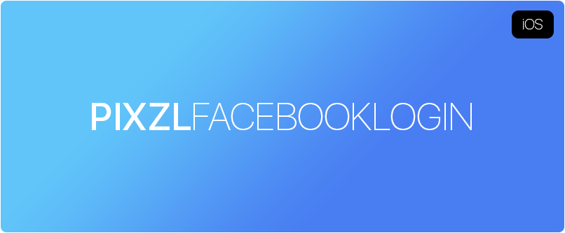
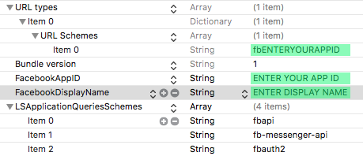

[](LICENSE)


The easiest way to integrate Facebook Login into your iOS app.

## Screenshot


Edit the .plist and add your Facebook application informations.

Download the Facebook SDK [from here](https://origincache.facebook.com/developers/resources/?id=facebook-ios-sdk-current.zip) and unpack the .zip file in ~/Documents/FacebookSDK.

## How to Install

You need Xcode 8 or later and an iOS device running at least iOS 10.

Step 1

Open a new terminal window in OS X. Refer to [this guide](http://blog.teamtreehouse.com/introduction-to-the-mac-os-x-command-line) on using the OS X Terminal.

```bash
git clone https://github.com/Pixzl/PixzlFacebookLogin
```

Step 2

```bash
  cd PixzlFacebookLogin
```

Step 3

Open `PixzlFacebookLogin` in Xcode.


Step 4

Build and run the application.

(When you running this application on a device you will need to add a signing profile in the project's Build Settings.)


## Tested

- iPhone 7 Plus running iOS 10.1
- iPhone 7 running iOS iOS 10.0.2
- iPad 6s Plus running iOS 9.3.3

## Device Compatibility

- iPhone
